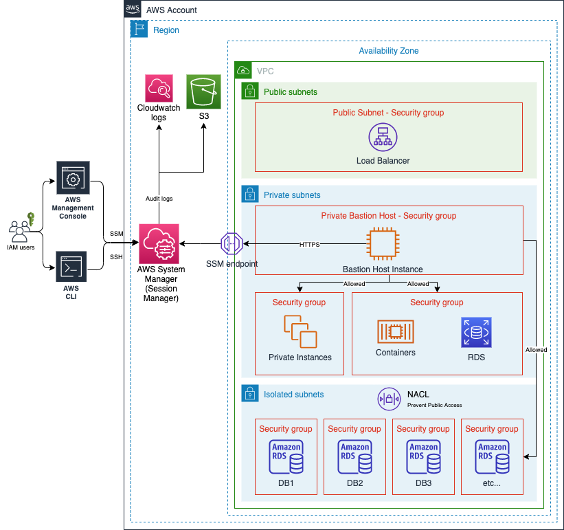
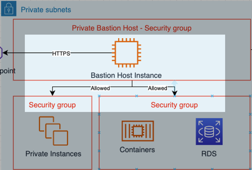
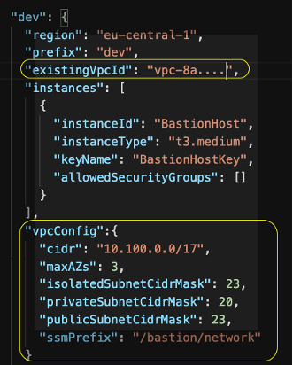
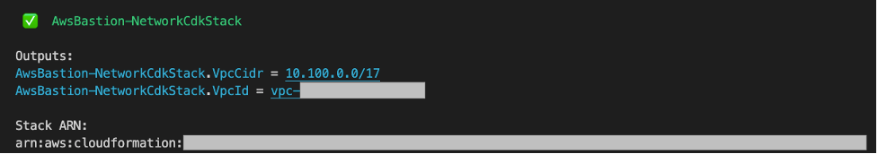
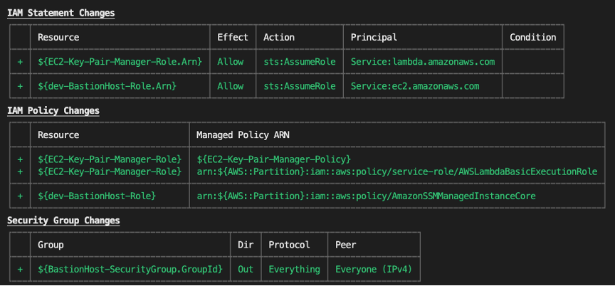
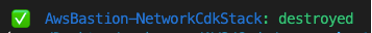

# Introduction
This project provides high level CDK construct describe how customers would be able to provision secure Bastion Hosts based on AWS best practices across various stages and environments. It provides complete example to show how to provision Bastion Hosts in a private subnet and leverage AWS session manager to provide least-privilege to access private resources which gives ability to open tunnel directly using SSM session manager or using SSH with ability to use port-forwarding. The implementation is extednable and encapsulate various settings which allow the customer to customize based on their business needs.

The requirment comes from several customers who are seeking a secure solution to provide temporary and limited access to resources in private or isolated subnets in AWS environments. For instance, there might be a need to grant access to private RDS instance in a non-production environment to group of developers. Bastion hosts is a known solution for this problem. However, it has some drawbacks, for instance it requires to be hosted in a public subnet in order to allow traffic from outside Amazon Virtual Private Cloud (VPC). This is a big security risk and requires more secure solution that allow access to private resources without compromise security. This project provides a solution with an extendable example to this problem.

The codebase is based on the experience from an engagment project where it provides a suffcient solution to the requirements for AWS customer.

# Pre-requisite
For the deployment, you must have the following:

- An AWS account. If you don’t have an AWS account, sign up at https://aws.amazon.com.
- [AWS Command Line Interface (AWS CLI)](https://docs.aws.amazon.com/cli/latest/userguide/install-cliv2.html).
- [Session Manager plugin for the AWS CLI](https://docs.aws.amazon.com/systems-manager/latest/userguide/session-manager-working-with-install-plugin.html)
- [Downloading and installing Node.js and npm](https://docs.npmjs.com/downloading-and-installing-node-js-and-npm)
- [AWS CDK Toolkit](https://docs.aws.amazon.com/cdk/latest/guide/getting_started.html)
 

# Solution Architecture

In the exercises that follow, we use CDK to deploy two stacks:
- Stack A ("AwsBastion-NetworkCdkStack") contains Amazon Virtual Private Cloud (VPC), and this stack is optional, if you have existing VPC you can use it by setting “existingVpcId” value in “cdk.json” file as explained in the walkthrough step 2.
- Stack B ("AwsBastion-Ec2CdkStack") contains Amazon Elastic Compute Cloud (Amazon EC2) which act as the Bastion Host and contains all the required resources for it:
    - Custom resource EC2-Key-Pair
    - IAM Role and IAM policy
    - Security Group

Here is a high-level architecture of the solution. 




As this diagram shows, standard VPC design in AWS account for specific region, the VPC contains three type of subnets. Public subnet, which contains public resources like Internet Load Balancer. Private subnet which contains private resources and in here we are deploying our Bastion Host instances. And finally, isolated subnets to deploy resources that we need to isolate from inbound and outbound internet traffic. In the configuration section of “cdk.json” you can define which resources ”allowedSecurityGroups” can be accessed by the Bastion Host, as shown on the diagram below:



# Installation
Complete the following steps using CDK to deploy the solution to your account
## Step 1: Configure your deployment environment
1.	Creating an [IAM user](https://docs.aws.amazon.com/IAM/latest/UserGuide/id_users_create.html) in your AWS account with programmatic access and attach “AdministratorAccess” IAM Managed Policy to it. 
2.	Create [AWS profile](https://docs.aws.amazon.com/cli/latest/userguide/cli-configure-profiles.html) named bastion-cdk using credentials from created user in step 1.
$ aws configure --profile bastion-cdk
Fill in the details required by the command as follow (for more information Follow [Configuration basics](https://docs.aws.amazon.com/cli/latest/userguide/cli-configure-quickstart.html)):
AWS Access Key ID [None]: (Your IAM user Access Key ID)
AWS Secret Access Key [None]: (Your IAM user Access Key Secret)
Default region name [None]: (Optionally You can set default region, for example “us-east-1” or leave it empty)
Default output format [None]: (Optionally You can set output format, for example “json” or leave it empty)
3.	Use your command-line shell to clone the GitHub repository.
$ git clone https://github.com/aws-samples/secure-bastion-cdk
4.	Navigate to the repository’s root directory
$ cd secure-bastion-cdk
5.	Run the following cdk command to bootstrap your AWS environment. The cdk command is the primary tool for interacting with an AWS CDK application.
$ cdk bootstrap aws://{account_id}/{your_selected_region}
Note: Bootstrapping launches resources into your AWS environment that are required by AWS CDK. These include an S3 bucket for storing files and [AWS Identity and Access Management (IAM)](https://aws.amazon.com/iam/) roles that grant permissions needed to run our deployment.

## Step 2: Configure your target environments
You can configure the environment you would like to deploy by changing the settings in cdk.json in the project root directory. A typical environment example as shown below will need the following properties to be created, you can add as many environments as you want, then refer to the target environment configuration in "cdk deploy -c environment="{environment_name}" as it will be explained in step 3 of this walkthrough.

```
"dev": {
      "region": "eu-central-1",
      "prefix": "my-demo",
      "existingVpcId": "",
      "instances": [
        {
          "instanceId": "BastionHost",
          "instanceType": "t3.medium",
          "keyName": "BastionHostKey",
          "allowedSecurityGroups": []
        }
      ],
      "vpcConfig":{
        "cidr": "10.100.0.0/17",
        "maxAZs": 3,
        "isolatedSubnetCidrMask": 23,
        "privateSubnetCidrMask": 20,
        "publicSubnetCidrMask": 23,
        "ssmPrefix": "/core/network"
      }
    }
```

Please note that you can use existing VPC with Private Subnet to provision the Bastion Host on it by setting value for (existingVpcId) properties. However, if you wish to deploy the solution to new VPC you can do so by setting (vpcConfig) properties. Then deploy "AwsBastion-NetworkCdkStack" first to provision the VPC as instructed in "Deploy the solution" setup below. Please find below example. 



You need to choose one approach, you can't use both, if there is any value in "existingVpcId" then it will be used over the second approach of creating new VPC.
In (allowedSecurityGroups) add all the Security Groups IDs for private resources that you would allow the bastion host to communicate with.

## Step 3: Deploy the Solution
Deploy the solution using the configured profile from step 1.

```
$ npm install #(compiles and installes necessary dependencies)
$ npm test    #(runs unit tests)
```

If you choose to deploy new VPC to be used for the Bastion Host, then you need to deploy "AwsBastion-NetworkCdkStack" first as follow.

```
$ cdk deploy -c environment="<Environment Name from cdk.json File>" -c account="<ACCOUNT TO DEPLOY Bastion>" AwsBastion-NetworkCdkStack --profile bastion-cdk 
```
You’ll be asked: Do you wish to deploy these changes (y/n)? Hit “y”. The successful output should look like this 



Now you can deploy "AwsBastion-Ec2CdkStack" stack

```
$ cdk deploy -c environment="<Environment Name from cdk.json File>" -c account="<ACCOUNT TO DEPLOY Bastion>" AwsBastion-Ec2CdkStack --profile bastion-cdk 
```

The following resources will be deployed



You’ll be asked: Do you wish to deploy these changes (y/n)? Hit “y”. The successful output should look like this 


## Step 4: Test the Solution

Here is how to connect to Bastion Host using SSM session manager and SSH to open a tunnel and access private resources on your environments. Please follow the following steps.

1.	You need IAM user which have the following permission attached to it.

```
{
    "Version": "2012-10-17",
    "Statement": [
        {
            "Effect": "Allow",
            "Action": [
                "ssm:StartSession"
            ],
            "Resource": [
                "arn:aws:ec2:*:{account_id}:instance/*"
            ],
            "Condition": {
                "StringLike": {
                    "ssm:resourceTag/Name": [
                        "BastionHost"
                    ]
                }
            }
        },
        {
            "Effect": "Allow",
            "Action": [
                "ec2:DescribeInstances",
                "ec2:DescribeImages",
                "ec2:DescribeTags",
                "ec2:DescribeSnapshots"
            ],
            "Resource": [
                "*"
            ]
        },
        {
            "Effect": "Allow",
            "Action": [
                "ssm:StartSession"
            ],
            "Resource": [
                "arn:aws:ssm:*::document/AWS-StartPortForwardingSession",
                "arn:aws:ssm:*::document/AWS-StartSSHSession"
            ]
        },
        {
            "Effect": "Allow",
            "Action": [
                "ssm:TerminateSession"
            ],
            "Resource": [
                "arn:aws:ssm:*:*:session/${aws:username}-*"
            ]
        },
        {
            "Effect": "Allow",
            "Action": [
                "secretsmanager:GetSecretValue",
                "secretsmanager:DescribeSecret",
                "secretsmanager:ListSecretVersionIds",
                "secretsmanager:ListSecrets"
            ],
            "Resource": [
                "arn:aws:secretsmanager:*:{account_id}:secret:*"
            ],
            "Condition": {
                "StringEquals": {
                    "secretsmanager:ResourceTag/{tag_key}": "{tag_value}"
                }
            }
        }
    ]
}
```

Note that you need to provide value for the {account_id} and if you would like to limit the access to specific secret resource using tags add the value for {tag_key}": "{tag_value}, else you can remove the condition which will give the user permission for all secrets in the mentioned account, which is not recommended.

2.	Please make sure that you set AWS profile on your local machine (which you use to test the connection to the bastion host) with credential of the user created in step one.

```
$ aws configure --profile bastion-test
```

3.	Read required parameters: You will need the ec2 instance ID to connect to session manager.

```
	$INSTANCE_ID=$(aws ec2 describe-instances \
         --filter "Name=tag:Name,Values= BastionHost" \
  --query "Reservations[].Instances[?State.Name =='running'].InstanceId[]" \
               --output text --profile bastion-test)
```

4.	Connect using AWS Systems Manager session manager: You can use AWS Systems Manager session manager to connect to your Bastion Host using the following command

```
aws ssm start-session --target $INSTANCE_ID --profile bastion-test
```

You can also use port forward session using the following command

```
aws ssm start-session --target $INSTANCE_ID \
                       --document-name AWS-StartPortForwardingSession \
                       --parameters '{"portNumber":["{remote_port_number}"],"localPortNumber":["{your_local_port_number}"]}' --profile bastion-test
```

You need to replace {remote_port_number}, {your_local_port_number} with the target port numbers from remote server to local port.

5.	Connect using SSH
Update the SSH configuration file to allow running a proxy command that starts a Session Manager session and transfer all data through the connection.

```
vim ~/.ssh/config
 
#Add SSH over Session Manager
host i-* mi-*
    ProxyCommand sh -c "aws ssm start-session --target %h --document-name AWS-StartSSHSession --parameters 'portNumber=%p'"
```

Get instance key pair (which is deployed as part of "AwsBastion-Ec2CdkStack" stack deployment in step 3 and pushed to [AWS Secret Manager](https://aws.amazon.com/secrets-manager/)

```
aws secretsmanager get-secret-value \
  --secret-id ec2-ssh-key/BastionHostKey/private \
  --query SecretString \
  --output text --profile bastion-test > bastion-key-pair.pem
 
chmod 400 bastion-key-pair.pem
```

Open ssh tunnel

```
ssh -f -N ec2-user@$INSTANCE_ID -L {local_port}:{host}:{remote_port} -i bastion-key-pair.pem
```

You need to replace {local_port} for your local port, {host} for example RDS endpoint, And {remote_port} for the target remote port such as 3306 mysql port.
You’ll be asked: The authenticity of host '$INSTANCE_ID ()' can't be established. ECDSA key fingerprint is SHA256:.... Are you sure you want to continue connecting (yes/no/[fingerprint])?
Hit “yes” and the $INSTANCE_ID will be added to the list of known hosts.


# Clean up

To avoid unexpected charges to your account, make sure you clean up your CDK stack. You can either delete the stack through the AWS CloudFormation console or use CDK destroy:

```
cdk destroy -c environment="<environment_name>" -c account="<ACCOUNT ID>" AwsBastion-Ec2CdkStack --profile bastion-cdk
```

You’ll be asked: Are you sure you want to delete: AwsBastion-NetworkCdkStack, AwsBastion-Ec2CdkStack (y/n)?
Hit “y” and you’ll see your stack being destroyed. A successful output should look like the following.


And if you choose to deploy the "AwsBastion-NetworkCdkStack" stack you can clean it up using the following Command

```
cdk destroy -c environment="<environment_name>" -c account="<ACCOUNT ID>" AwsBastion-NetworkCdkStack --profile bastion-cdk
```

A successful output should look like the following.



Finally, if you executed steps in “Step 4: Test the Solution” you will need to remove the created IAM Policy and the IAM user. Please follow the steps in [this User Guide](https://docs.aws.amazon.com/IAM/latest/UserGuide/access_policies_manage-delete.html) to delete the policy using AWS CLI or Console and [this User Guide](https://docs.aws.amazon.com/IAM/latest/UserGuide/id_users_manage.html#:~:text=To%20delete%20an%20IAM%20user%20(console),of%20the%20page%2C%20choose%20Delete.) to delete the IAM user. 


## Security

See [CONTRIBUTING](CONTRIBUTING.md#security-issue-notifications) for more information.

## License

This library is licensed under the MIT-0 License. See the LICENSE file.